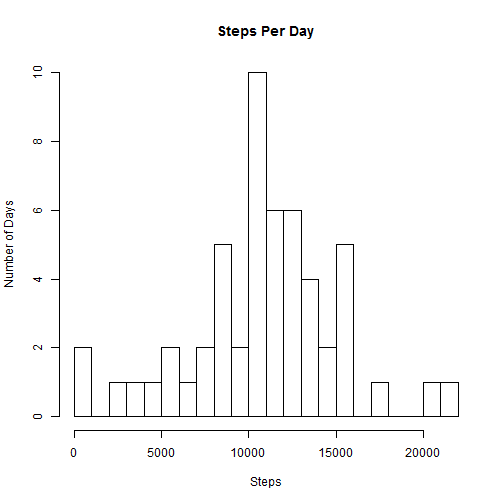
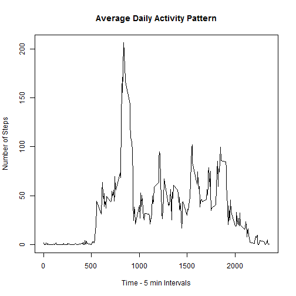
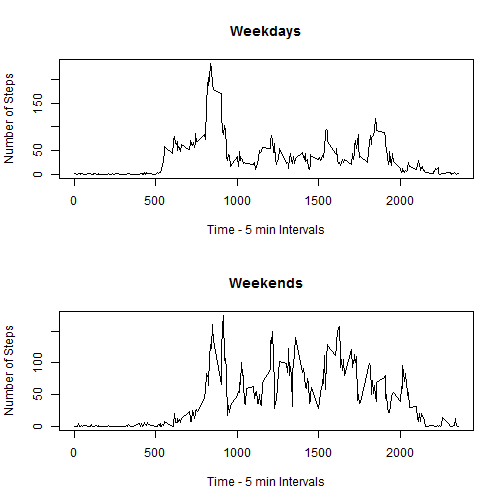

## Loading and preprocessing the data
;

```r
setwd("C:/before_it_breaks/coursera/RepData_PeerAssessment1")
activity <- read.csv("activity/activity.csv") 
str(activity)
```

```
## 'data.frame':	17568 obs. of  3 variables:
##  $ steps   : int  NA NA NA NA NA NA NA NA NA NA ...
##  $ date    : Factor w/ 61 levels "2012-10-01","2012-10-02",..: 1 1 1 1 1 1 1 1 1 1 ...
##  $ interval: int  0 5 10 15 20 25 30 35 40 45 ...
```

```r
head(activity)
```

```
##   steps       date interval
## 1    NA 2012-10-01        0
## 2    NA 2012-10-01        5
## 3    NA 2012-10-01       10
## 4    NA 2012-10-01       15
## 5    NA 2012-10-01       20
## 6    NA 2012-10-01       25
```

## What is mean total number of steps taken per day?
create new dataset without missing data

```r
activity1 = as.data.frame(activity[complete.cases(activity), ])
str(activity1)
```

```
## 'data.frame':	15264 obs. of  3 variables:
##  $ steps   : int  0 0 0 0 0 0 0 0 0 0 ...
##  $ date    : Factor w/ 61 levels "2012-10-01","2012-10-02",..: 2 2 2 2 2 2 2 2 2 2 ...
##  $ interval: int  0 5 10 15 20 25 30 35 40 45 ...
```

Calculate the total number of steps taken per day

```r
steps_per_day <- aggregate(activity1$steps, list(activity1$date), sum)
colnames(steps_per_day) <- c("date", "steps")
print(steps_per_day)
```

```
##          date steps
## 1  2012-10-02   126
## 2  2012-10-03 11352
## 3  2012-10-04 12116
## 4  2012-10-05 13294
## 5  2012-10-06 15420
## 6  2012-10-07 11015
## 7  2012-10-09 12811
## 8  2012-10-10  9900
## 9  2012-10-11 10304
## 10 2012-10-12 17382
## 11 2012-10-13 12426
## 12 2012-10-14 15098
## 13 2012-10-15 10139
## 14 2012-10-16 15084
## 15 2012-10-17 13452
## 16 2012-10-18 10056
## 17 2012-10-19 11829
## 18 2012-10-20 10395
## 19 2012-10-21  8821
## 20 2012-10-22 13460
## 21 2012-10-23  8918
## 22 2012-10-24  8355
## 23 2012-10-25  2492
## 24 2012-10-26  6778
## 25 2012-10-27 10119
## 26 2012-10-28 11458
## 27 2012-10-29  5018
## 28 2012-10-30  9819
## 29 2012-10-31 15414
## 30 2012-11-02 10600
## 31 2012-11-03 10571
## 32 2012-11-05 10439
## 33 2012-11-06  8334
## 34 2012-11-07 12883
## 35 2012-11-08  3219
## 36 2012-11-11 12608
## 37 2012-11-12 10765
## 38 2012-11-13  7336
## 39 2012-11-15    41
## 40 2012-11-16  5441
## 41 2012-11-17 14339
## 42 2012-11-18 15110
## 43 2012-11-19  8841
## 44 2012-11-20  4472
## 45 2012-11-21 12787
## 46 2012-11-22 20427
## 47 2012-11-23 21194
## 48 2012-11-24 14478
## 49 2012-11-25 11834
## 50 2012-11-26 11162
## 51 2012-11-27 13646
## 52 2012-11-28 10183
## 53 2012-11-29  7047
```

Make a histogram of the total number of steps taken each day

```r
hist(steps_per_day$steps, 
     breaks=20,
     main="Steps Per Day", 
     ylab="Number of Days", 
     xlab="Steps")
```



Mean and median total number of steps taken per day

```r
mean_steps_per_day <- mean(steps_per_day$steps)  
print(mean_steps_per_day) 
```

```
## [1] 10766.19
```

```r
median_steps_per_day <- median(steps_per_day$steps)  
print(median_steps_per_day) 
```

```
## [1] 10765
```

## What is the average daily activity pattern?
Make a time series plot (i.e. type = "l") of the 5-minute interval (x-axis) and the average number of steps taken, averaged across all days (y-axis)

```r
steps_per_interval<- aggregate(activity1$steps, list(activity1$interval), FUN=mean)
colnames(steps_per_interval) <- c("interval", "steps")

plot(x = steps_per_interval$interval, 
     y = steps_per_interval$steps, 
     type = "l",
     xlab = "Time - 5 min Intervals", 
     ylab = "Number of Steps", 
     main = "Average Daily Activity Pattern")
```



Which 5-minute interval, on average across all the days in the dataset, contains the maximum number of steps?


```r
max_steps_interval <- max(steps_per_interval$steps)
print(max_steps_interval)
```

```
## [1] 206.1698
```


## Imputing missing values
Calculate and report the total number of missing values in the dataset (i.e. the total number of rows with NAs)

```r
count_nas <- sum(is.na(activity$steps))
```

Create a new dataset that is equal to the original dataset but with the missing data filled in.


```r
activity2 <- activity
activity2$steps[which(is.na(activity2$steps))] <- mean(steps_per_interval$steps)
```

Make a histogram of the total number of steps taken each day 


```r
steps_per_day2 <- aggregate(activity2$steps, list(activity2$date), sum)
colnames(steps_per_day2) <- c("date", "steps")
print(steps_per_day2)
```

```
##          date    steps
## 1  2012-10-01 10766.19
## 2  2012-10-02   126.00
## 3  2012-10-03 11352.00
## 4  2012-10-04 12116.00
## 5  2012-10-05 13294.00
## 6  2012-10-06 15420.00
## 7  2012-10-07 11015.00
## 8  2012-10-08 10766.19
## 9  2012-10-09 12811.00
## 10 2012-10-10  9900.00
## 11 2012-10-11 10304.00
## 12 2012-10-12 17382.00
## 13 2012-10-13 12426.00
## 14 2012-10-14 15098.00
## 15 2012-10-15 10139.00
## 16 2012-10-16 15084.00
## 17 2012-10-17 13452.00
## 18 2012-10-18 10056.00
## 19 2012-10-19 11829.00
## 20 2012-10-20 10395.00
## 21 2012-10-21  8821.00
## 22 2012-10-22 13460.00
## 23 2012-10-23  8918.00
## 24 2012-10-24  8355.00
## 25 2012-10-25  2492.00
## 26 2012-10-26  6778.00
## 27 2012-10-27 10119.00
## 28 2012-10-28 11458.00
## 29 2012-10-29  5018.00
## 30 2012-10-30  9819.00
## 31 2012-10-31 15414.00
## 32 2012-11-01 10766.19
## 33 2012-11-02 10600.00
## 34 2012-11-03 10571.00
## 35 2012-11-04 10766.19
## 36 2012-11-05 10439.00
## 37 2012-11-06  8334.00
## 38 2012-11-07 12883.00
## 39 2012-11-08  3219.00
## 40 2012-11-09 10766.19
## 41 2012-11-10 10766.19
## 42 2012-11-11 12608.00
## 43 2012-11-12 10765.00
## 44 2012-11-13  7336.00
## 45 2012-11-14 10766.19
## 46 2012-11-15    41.00
## 47 2012-11-16  5441.00
## 48 2012-11-17 14339.00
## 49 2012-11-18 15110.00
## 50 2012-11-19  8841.00
## 51 2012-11-20  4472.00
## 52 2012-11-21 12787.00
## 53 2012-11-22 20427.00
## 54 2012-11-23 21194.00
## 55 2012-11-24 14478.00
## 56 2012-11-25 11834.00
## 57 2012-11-26 11162.00
## 58 2012-11-27 13646.00
## 59 2012-11-28 10183.00
## 60 2012-11-29  7047.00
## 61 2012-11-30 10766.19
```

```r
hist(steps_per_day$steps, 
     breaks=20,
     main="Steps Per Day", 
     ylab="Number of Days", 
     xlab="Steps")
```


mean and median total number of steps taken per day


```r
mean_steps_per_day2 <- mean(steps_per_day2$steps)  
print(mean_steps_per_day2) 
```

```
## [1] 10766.19
```

```r
median_steps_per_day2 <- median(steps_per_day2$steps)  
print(median_steps_per_day2) 
```

```
## [1] 10766.19
```
Do these values differ from the estimates from the first part of the assignment? What is the impact of imputing missing data on the estimates of the total daily number of steps?
> input mean steps per internal (37.xx) and see very little change


## Are there differences in activity patterns between weekdays and weekends?
Yes, a little heavier activity on weekends and more activity thoughout the day.

define dates as weekday and weekend

```r
activity1$date <- as.POSIXct(activity1$date) 
activity1$week <- ifelse(weekdays(activity1$date) == "Saturday" | weekdays(activity1$date) == "Sunday" ,"weekend","weekday")
```

define weekend and weekday sets

```r
steps_per_day_type <- aggregate(activity1$steps, list(activity1$week, activity1$interval), mean)  
str(steps_per_day_type)
```

```
## 'data.frame':	576 obs. of  3 variables:
##  $ Group.1: chr  "weekday" "weekend" "weekday" "weekend" ...
##  $ Group.2: int  0 0 5 5 10 10 15 15 20 20 ...
##  $ x      : num  2.333 0 0.462 0 0.179 ...
```

```r
names(steps_per_day_type) = c("day_type", "interval","mean_steps")

weekend_spd <- steps_per_day_type[steps_per_day_type$day_type == "weekend",]
weekday_spd <- steps_per_day_type[steps_per_day_type$day_type == "weekday",]

names(weekend_spd) = c("day_type", "interval","mean_steps")
names(weekday_spd) = c("day_type", "interval","mean_steps")
```


plot both the weekend and weekday sets


```r
par(mfrow = c(2,1))

plot(x = weekday_spd$interval, 
     y = weekday_spd$mean_steps, 
     type = "l",
     xlab = "Time - 5 min Intervals", 
     ylab = "Number of Steps", 
     main = "Weekdays")


plot(x = weekend_spd$interval, 
     y = weekend_spd$mean_steps, 
     type = "l",
     xlab = "Time - 5 min Intervals", 
     ylab = "Number of Steps", 
     main = "Weekends")
```




